[](https://supportukrainenow.org)

# Complex period comparisons

[](https://packagist.org/packages/spatie/period)
[](https://scrutinizer-ci.com/g/spatie/period)
[](https://packagist.org/packages/spatie/period)

This package adds support for comparing multiple dates with each other.
You can calculate the overlaps and differences between n-amount of periods,
as well as some more basic comparisons between two periods.

Periods can be constructed from any type of `DateTime` implementation, 
making this package compatible with custom `DateTime` implementations like
[Carbon](https://carbon.nesbot.com)
(see [cmixin/enhanced-period](https://github.com/kylekatarnls/enhanced-period) to
convert directly from and to CarbonPeriod).

Periods are always immutable, there's never the worry about your input dates being changed. 

## Support us

[](https://spatie.be/github-ad-click/period)

We invest a lot of resources into creating [best in class open source packages](https://spatie.be/open-source). You can support us by [buying one of our paid products](https://spatie.be/open-source/support-us).

We highly appreciate you sending us a postcard from your hometown, mentioning which of our package(s) you are using. You'll find our address on [our contact page](https://spatie.be/about-us). We publish all received postcards on [our virtual postcard wall](https://spatie.be/open-source/postcards).

## Installation

You can install the package via composer:

```bash
composer require spatie/period
```

## Usage

### Creating periods

You're encouraged to create periods using their static constructor:

```php
$period = Period::make('2021-01-01', '2021-01-31');
```

You can manually construct a period, but you'll need to manually provide its **precision** and **boundaries**. Using `Period::make`, the default precision (`Precision::DAY()`) and default boundaries (`Boundaries::EXCLUDE_NONE()`) are used. 

Before discussing the API provided by this package, it's important to understand both how precision and boundaries are used.

#### Precision

Date precision is of utmost importance if you want to reliably compare two periods.
The following example:

> Given two periods: `[2021-01-01, 2021-01-15]` and `[2021-01-15, 2021-01-31]`; do they overlap?

At first glance the answer is "yes": they overlap on `2021-01-15`. 
But what if the first period ends at `2021-01-15 10:00:00`, 
while the second starts at `2021-01-15 15:00:00`? 
Now they don't anymore!

This is why this package requires you to specify a precision with each period. 
Only periods with the same precision can be compared.

A more in-depth explanation on why precision is so important can be found [here](https://stitcher.io/blog/comparing-dates).
A period's precision can be specified when constructing that period:

```php
Period::make('2021-01-01', '2021-02-01', Precision::DAY());
```

The default precision is set on days. These are the available precision options:

```php
Precision::YEAR()
Precision::MONTH()
Precision::DAY()
Precision::HOUR()
Precision::MINUTE()
Precision::SECOND()
```

#### Boundaries

By default, period comparisons are done with included boundaries. 
This means that these two periods overlap:

```php
$a = Period::make('2021-01-01', '2021-02-01');
$b = Period::make('2021-02-01', '2021-02-28');

$a->overlapsWith($b); // true
```

The length of a period will also include both boundaries:

```php
$a = Period::make('2021-01-01', '2021-01-31');

$a->length(); // 31
```

It's possible to override the boundary behaviour:

```php
$a = Period::make('2021-01-01', '2021-02-01', boundaries: Boundaries::EXCLUDE_END());
$b = Period::make('2021-02-01', '2021-02-28', boundaries: Boundaries::EXCLUDE_END());

$a->overlapsWith($b); // false
```

There are four types of boundary exclusion:

```php
Boundaries::EXCLUDE_NONE();
Boundaries::EXCLUDE_START();
Boundaries::EXCLUDE_END();
Boundaries::EXCLUDE_ALL();
```

### Reference

The `Period` class offers a rich API to interact and compare with other periods and collections of periods. Take into account that only periods with the same precision can be compared:

- `startsBefore(DateTimeInterface $date): bool`: whether a period starts before a given date.
- `startsBeforeOrAt(DateTimeInterface $date): bool`: whether a period starts before or at a given date.
- `startsAfter(DateTimeInterface $date): bool`: whether a period starts after a given date.
- `startsAfterOrAt(DateTimeInterface $date): bool`: whether a period starts after or at a given date.
- `startsAt(DateTimeInterface $date): bool`: whether a period starts at a given date.
- `endsBefore(DateTimeInterface $date): bool`: whether a period ends before a given date.
- `endsBeforeOrAt(DateTimeInterface $date): bool`: whether a period end before or at a given date.
- `endsAfter(DateTimeInterface $date): bool`: whether a period ends after a given date.
- `endsAfterOrAt(DateTimeInterface $date): bool`: whether a period end after or at a given date.
- `endsAt(DateTimeInterface $date): bool`: whether a period starts ends at a given date.
- `overlapsWith(Period $period): bool`: whether a period overlaps with another period.
- `touchesWith(Period $other): bool`: whether a period touches with another period.
- `contains(DateTimeInterface|Period $other): bool`: whether a period contains another period _or_ a single date.
- `equals(Period $period): bool`: whether a period equals another period.

---

On top of comparisons, the `Period` class also offers a bunch of operations:

### `overlap(Period ...$others): ?static`

Overlaps two or more periods on each other. The resulting period will be the union of all other periods combined.

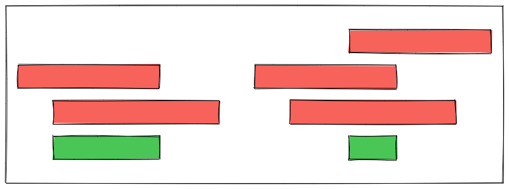

### `overlapAny(Period ...$others): PeriodCollection`

Overlaps two or more periods on each other. Whenever two or more periods overlap, that overlapping period is added to a collection which will be returned as the final result.

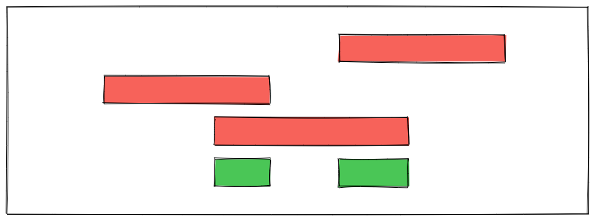

### `subtract(Period ...$others): PeriodCollection`

Subtracts one or more periods from the main period. This is the inverse operation of overlap.

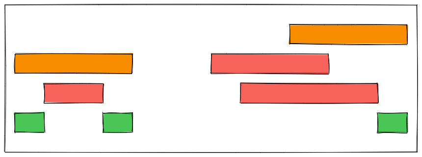

### `gap(Period $period): ?static`

Gets the gap between two periods, or 0 if the periods overlap.

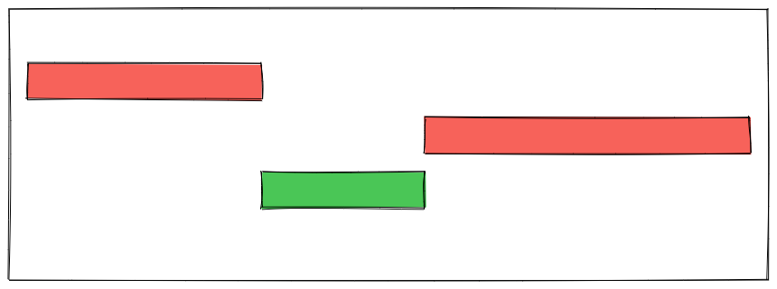

### `diffSymmetric(Period $other): PeriodCollection`

Performs a [symmetric diff](https://www.math-only-math.com/symmetric-difference-using-Venn-diagram.html) between two periods.

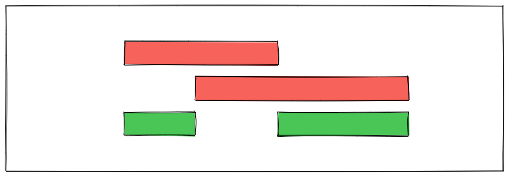

### `renew(): static`

Renew the current period, creating a new period with the same length that happens _after_ the current period.

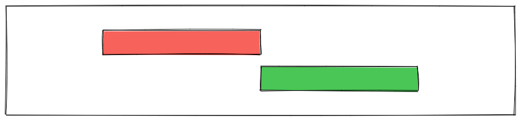

---

Next, the `Period` class also has some getters:

- `isStartIncluded(): bool`
- `isStartExcluded(): bool`
- `isEndIncluded(): bool`
- `isEndExcluded(): bool`
- `start(): DateTimeImmutable`
- `includedStart(): DateTimeImmutable`
- `end(): DateTimeImmutable`
- `includedEnd(): DateTimeImmutable`
- `ceilingEnd(Precision::SECOND): DateTimeImmutable`
- `length(): int`
- `duration(): PeriodDuration`
- `precision(): Precision`
- `boundaries(): Boundaries`

---

The `PeriodCollection` class represents a collection of periods and has some useful methods on its own:

### `overlapAll(PeriodCollection ...$others): PeriodCollection`

Overlaps all collection periods on each other.

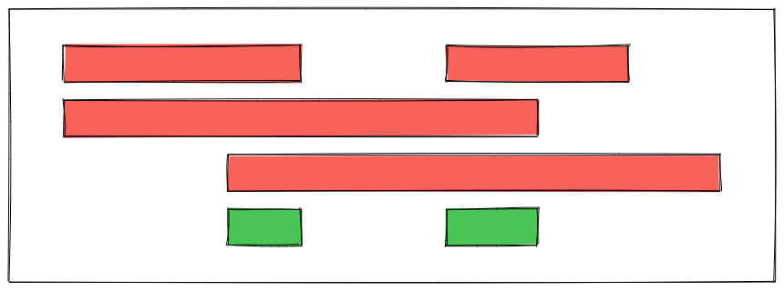

### `subtract(PeriodCollection|Period ...$others): PeriodCollection`

Subtracts a period or a collection of periods from a period collection.

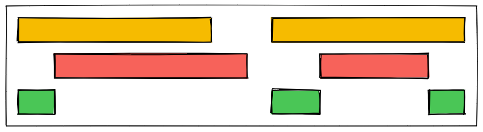

### `boundaries(): ?Period` 

Creates a new period representing the outer boundaries of the collection.

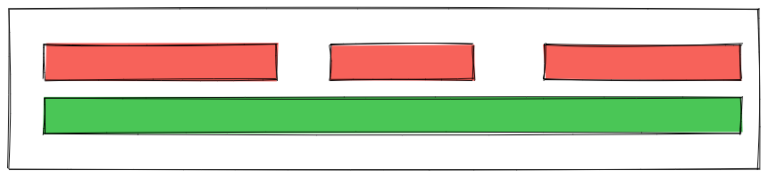

### `gaps(): static`

Gives the gaps for all periods within this collection.

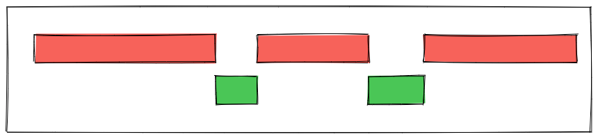

### `intersect(Period $intersection): static`

Intersects given period with every period within a collection. The result is a new collection of overlapping periods between given period and every period in the collection. When there's no overlap, the original period is discarded.

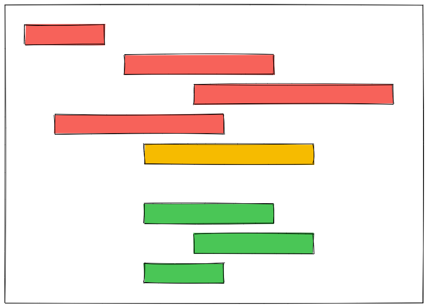

### `union(): static`

Merges all periods in collection with overlapping ranges.


---

Finally, there are a few utility methods available on `PeriodCollection` as well:

- `add(Period ...$periods): static`
- `map(Closure $closure): static`:
- `reduce(Closure $closure, $initial = null): mixed`: 
- `filter(Closure $closure): static`: 
- `isEmpty(): bool`:

### Compatibility

You can construct a `Period` from any type of `DateTime` object such as Carbon:

```php
Period::make(Carbon::make('2021-01-01'), Carbon::make('2021-01-02'));
```

Note that as soon as a period is constructed, all further operations on it are immutable.
There's never the danger of changing the input dates.

You can iterate a `Period` like a regular `DatePeriod` with the precision specified on creation:

```php
$datePeriod = Period::make(Carbon::make('2021-01-01'), Carbon::make('2021-01-31'));

foreach ($datePeriod as $date) {
    /** @var DateTimeImmutable $date */
    // 2021-01-01
    // 2021-01-02
    // ...
    // (31 iterations)
}

$timePeriod = Period::make(Carbon::make('2021-01-01 00:00:00'), Carbon::make('2021-01-01 23:59:59'), Precision::HOUR);

foreach ($timePeriod as $time) {
    /** @var DateTimeImmutable $time */
    // 2021-01-01 00:00:00
    // 2021-01-01 01:00:00
    // ...
    // (24 iterations)
}
```

### Visualizing periods

You can visualize one or more `Period` objects as well as `PeriodCollection`
objects to see how they related to one another:

```php
$visualizer = new Visualizer(["width" => 27]);

$visualizer->visualize([
    "A" => Period::make('2021-01-01', '2021-01-31'),
    "B" => Period::make('2021-02-10', '2021-02-20'),
    "C" => Period::make('2021-03-01', '2021-03-31'),
    "D" => Period::make('2021-01-20', '2021-03-10'),
    "OVERLAP" => new PeriodCollection(
        Period::make('2021-01-20', '2021-01-31'),
        Period::make('2021-02-10', '2021-02-20'),
        Period::make('2021-03-01', '2021-03-10')
    ),
]);
```

And visualize will return the following string:

```
A          [========]
B                      [==]
C                           [========]
D               [==============]
OVERLAP         [===]  [==] [==]
```

The visualizer has a configurable width provided upon creation
which will control the bounds of the displayed periods:

```php
$visualizer = new Visualizer(["width" => 10]);
```

### Testing

``` bash
composer test
```

### Changelog

Please see [CHANGELOG](CHANGELOG.md) for more information on what has changed recently.

## Contributing

Please see [CONTRIBUTING](https://github.com/spatie/.github/blob/main/CONTRIBUTING.md) for details.

### Security

If you've found a bug regarding security please mail [security@spatie.be](mailto:security@spatie.be) instead of using the issue tracker.

## Postcardware

You're free to use this package, but if it makes it to your production environment we highly appreciate you sending us a postcard from your hometown, mentioning which of our package(s) you are using.

Our address is: Spatie, Kruikstraat 22, 2021 Antwerp, Belgium.

We publish all received postcards [on our company website](https://spatie.be/en/opensource/postcards).

## Credits

- [Brent Roose](https://github.com/brendt)
- [All Contributors](../../contributors)

## License

The MIT License (MIT). Please see [License File](LICENSE.md) for more information.
